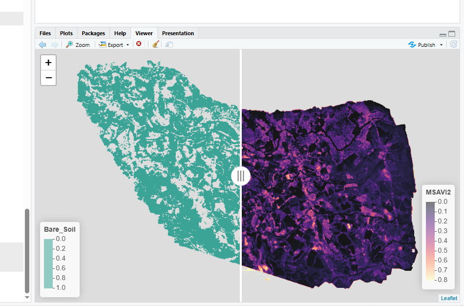
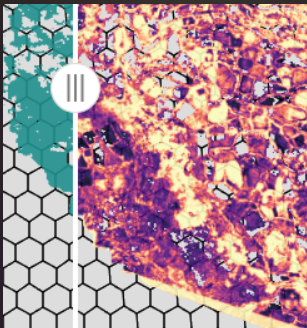

# drones4health: Ultra-High Resolution Drone Metrics for Spatial Health Analysis

<!-- badges: start -->
[](https://www.r-project.org/)
[](https://opensource.org/licenses/MIT)
[](https://www.who.int/health-topics/one-health)
<!-- badges: end -->

**`drones4health`** is an R package designed to extract, analyze, and synthesize ultra-high resolution (centimeter-level) remote sensing indicators from Unmanned Aerial Vehicle (UAV) orthomosaics within a **One Health** framework. It bridges micro-environmental landscape ecology with spatial epidemiology for precision vector control, environmental health surveillance, and localized pathogen transmission risk modeling.

---

## 1. Installation

You can install the development version of `drones4health` directly from GitHub:

```r
# If not yet installed: install.packages("pak")
pak::pak("JosueFlorian17/drones4health-version-control")
```

Or using `remotes` / `devtools`:

```r
# install.packages("remotes")
remotes::install_github("JosueFlorian17/drones4health-version-control")
```

```r
library(drones4health)
library(terra)
library(sf)
```

---

## 2. Micro-Environmental Indicators: Mathematical Formulas & References

The package computes physical, spectral, topographical, and eco-epidemiological indicators. All functions accept `terra::SpatRaster` objects or direct file paths, automatically handle spatial co-registration, and mask background artifacts to `NA`.

### A. Spectral Vegetation & Moisture Indices

* **Normalized Difference Vegetation Index (NDVI)** *(Rouse et al., 1974)*:
  $$\text{NDVI} = \frac{\text{NIR} - \text{Red}}{\text{NIR} + \text{Red}}$$
  Quantifies photosynthetic capacity, vegetation vigor, and dense biomass cover.

* **Modified Soil-Adjusted Vegetation Index 2 (MSAVI2)** *(Qi et al., 1994)*:
  $$\text{MSAVI2} = \frac{2 \cdot \text{NIR} + 1 - \sqrt{(2 \cdot \text{NIR} + 1)^2 - 8 \cdot (\text{NIR} - \text{Red})}}{2}$$
  Self-adjusting index optimized for arid, semi-arid, or sparse vegetation canopies without requiring an empirical soil adjustment parameter ($L$).

* **Soil-Adjusted Vegetation Index (SAVI)** *(Huete, 1988)*:
  $$\text{SAVI} = \frac{\text{NIR} - \text{Red}}{\text{NIR} + \text{Red} + L} \times (1 + L) \quad \text{with } L = 0.5$$

* **Visible Atmospherically Resistant Index (VARI)** *(Gitelson et al., 2002)*:
  $$\text{VARI} = \frac{\text{Green} - \text{Red}}{\text{Green} + \text{Red} - \text{Blue}}$$
  Estimates vegetation fraction from visible RGB channels while minimizing atmospheric scattering and illumination variance.

* **Normalized Difference Red Edge (NDRE)** *(Barnes et al., 2000)*:
  $$\text{NDRE} = \frac{\text{NIR} - \text{RedEdge}}{\text{NIR} + \text{RedEdge}}$$
  Measures canopy chlorophyll concentration in mature, high-density vegetative cover where standard NDVI saturates.

* **Green Normalized Difference Vegetation Index (GNDVI)** *(Gitelson et al., 1996)*:
  $$\text{GNDVI} = \frac{\text{NIR} - \text{Green}}{\text{NIR} + \text{Green}}$$

* **Normalized Difference Water Index (NDWI)** *(McFeeters, 1996)*:
  $$\text{NDWI} = \frac{\text{Green} - \text{NIR}}{\text{Green} + \text{NIR}}$$
  Identifies open water bodies, surface moisture, and localized pooling.

* **Enhanced Vegetation Index (EVI)** *(Huete et al., 2002)*:
  $$\text{EVI} = G \times \frac{\text{NIR} - \text{Red}}{\text{NIR} + C_1 \cdot \text{Red} - C_2 \cdot \text{Blue} + L}$$

* **Corrected Transformed Vegetation Index (CTVI)** *(Perry & Lautenschlager, 1984)*:
  $$\text{CTVI} = \frac{\text{NDVI} + 0.5}{\sqrt{|\text{NDVI} + 0.5|}}$$

* **Bare Soil Binary Mask**:
  $$\text{BareSoilMask} = \begin{cases} 1 & \text{if } \text{NDVI} < \theta \text{ (default: } \theta = 0.15 \text{)} \\ 0 & \text{otherwise} \end{cases}$$

---

### B. Micro-Topography & Hydrological Indices

* **Terrain Slope ($\beta$)** *(Burrough & McDonnell, 1998)*:
  $$\beta = \arctan\left(\sqrt{\left(\frac{\partial z}{\partial x}\right)^2 + \left(\frac{\partial z}{\partial y}\right)^2}\right)$$

* **Topographic Wetness Index (TWI)** *(Beven & Kirkby, 1979)*:
  $$\text{TWI} = \ln\left(\frac{a}{\tan \beta}\right)$$
  Where $a$ represents the specific catchment area and $\beta$ is the local slope angle, highlighting micro-depressions prone to persistent water stagnation.

---

### C. Eco-Epidemiological Risk Indices (One Health)

* **Index of Micro-accumulation of Solid Waste (IMSR)**:
  $$\text{IMSR} = \text{clamp}\left(\frac{\text{RedEdge} - \text{Red}}{\text{NIR} + \text{Red} + \epsilon}, 0, 1\right)$$
  Identifies discarded artificial plastic containers, discarded tires, and domestic waste clusters that serve as *Aedes aegypti* oviposition habitats.

* **Index of High-Risk Hydric Environments (IRHE)**:
  $$\text{IRHE} = \text{NDWI}_{\text{pos}} \times (1 - \text{Slope}_{\text{norm}})$$
  Synthesizes hydric accumulation and flat micro-terrain to isolate stagnant puddles and larval breeding foci.

* **Entomological Vector Suitability Index (IEV)**:
  $$\text{IEV} = w_1 \cdot \text{TWI}_{\text{norm}} + w_2 \cdot \text{NDWI}_{\text{norm}} + w_3 \cdot (1 - \text{Slope}_{\text{norm}})$$

* **Thermal Surface Risk Index (IRTS)**:
  Calibrates micro-climatic surface temperature ($LST$) from thermal UAV sensors to identify critical thermal windows for larval development ($22^\circ\text{C} - 32^\circ\text{C}$).

---

## 3. End-to-End Workflow Example

```r
library(drones4health)
library(terra)

# 1. Define paths to UAV multispectral and elevation bands
path_nir <- "data/Ohuay_NIR.tif"
path_r   <- "data/Ohuay_R.tif"
path_re  <- "data/Ohuay_RE.tif"
path_dem <- "data/Ohuay_D.tif"

# 2. Compute spectral indices and discrete masks
r_ndvi      <- d4h_ndvi(nir = path_nir, red = path_r)
r_msavi2    <- d4h_msavi2(nir = path_nir, red = path_r)
r_bare_soil <- d4h_bare_soil(ndvi_raster = r_ndvi, threshold = 0.15)

# 3. Compute micro-terrain slope and topographic wetness
r_slope     <- d4h_slope(dem_raster = path_dem, unit = "degrees")
r_twi       <- d4h_twi(dem_raster = path_dem)

# 4. Extract artificial waste micro-accumulation risk (IMSR)
r_imsr      <- d4h_imsr(red_edge = path_re, red = path_r, nir = path_nir)
```

---

## 4. Surveillance Zonation & Hexagonal Grids

Generate field-operative spatial units (e.g., 25m or 50m diameter hexagons) for community vector control teams:

```r
# Generate 50m surveillance hexagonal grid
grid_hex <- d4h_hex_grid(aoi = r_ndvi, cell_size = 50)

# Compute zonal statistics per operational hexagon
grid_summary <- d4h_summarize_grid(
  raster_in = r_ndvi,
  cell_size = 50,
  square    = FALSE
)
```

---

## 5. Executive Reporting & Multi-Sheet Excel Export

Generate statistical moments, spatial extent in hectares, Tukey outlier fences ($Q_{25} - 1.5 \cdot \text{IQR}$, $Q_{75} + 1.5 \cdot \text{IQR}$), and domain-specific thematic stratum areas exported to `.xlsx`:

```r
# Multi-band executive report with direct Excel workbook export
resumen_ejecutivo <- d4h_executive_summary(
  raster_in = c(r_ndvi, r_msavi2, r_imsr),
  out_xlsx  = "salidas/Resumen_Ejecutivo_Drones.xlsx"
)

# Print executive console output
print(resumen_ejecutivo)
```

---

## 6. Visualization & Interactive Mapping

`drones4health` provides both static publication-ready cartography via `ggplot2` and an interactive Leaflet side-by-side swipe comparison widget (`d4h_mapview_swipe`).

### A. Interactive Side-by-Side Swipe Comparison

Compare continuous indices, binary masks, and hexagonal grids with a single slider bar and dynamic contrast stretching:

```r
# Highlight bare soil pixels (value 1) as teal over MSAVI2 in magma palette
r_solo_suelo <- terra::ifel(r_bare_soil == 1, 1, NA)
names(r_solo_suelo) <- "Bare_Soil"

visor_swipe <- d4h_mapview_swipe(
  x        = r_solo_suelo,
  y        = r_msavi2,
  grid     = NULL,                      # Optional: pass grid_hex to overlay polygons
  basemap  = FALSE,                     # FALSE = neutral / TRUE = satellite imagery
  col_x    = "#2a9d8f",                 # Teal discrete color for bare soil
  col_y    = "magma",                   # Magma continuous palette for MSAVI2
  limits_y = c(0, 0.8)                  # Dynamic contrast range
)

visor_swipe
```

#### Visual Outputs:

<p align="center">
  
  <br>
  <em>Figure 1: Interactive side-by-side swipe comparison between Discrete Bare Soil Mask (teal, left) and MSAVI2 (magma, right) with categorical and continuous legends.</em>
</p>

<p align="center">
  
  <br>
  <em>Figure 2: Operative hexagonal surveillance grid (50 m) overlaid on the swipe viewer.</em>
</p>

### B. Static Cartographic Mapping with `ggplot2`

```r
# Continuous index plot with transparent background
d4h_plot(r_ndvi, palette = "viridis", title = "NDVI Vegetation Vigor")

# Zonal grid map
d4h_plot(grid_summary, palette = "magma", title = "Hexagonal Surveillance Grid (50m)")
```

---

## 7. Scientific References & Bibliography

1. **Barnes, E. M., Clarke, T. R., Richards, S. E., Colaizzi, P. D., Sloan, J., Moran, M. S., ... & Pinter, P. J.** (2000). Coincident detection of crop water stress, nitrogen status and canopy density using ground-based multispectral data. *Proceedings of the 5th International Conference on Precision Agriculture*, 16, 1-15.
2. **Beven, K. J., & Kirkby, M. J.** (1979). A physically based, variable contributing area model of basin hydrology. *Hydrological Sciences Bulletin*, 24(1), 43-69.
3. **Burrough, P. A., & McDonnell, R. A.** (1998). *Principles of Geographical Information Systems*. Oxford University Press.
4. **Gitelson, A. A., Kaufman, Y. J., Stark, R., & Rundquist, D.** (2002). Novel algorithms for remote estimation of vegetation fraction. *Remote Sensing of Environment*, 80(1), 76-87.
5. **Gitelson, A. A., Merzlyak, M. N., & Lichtenthaler, H. K.** (1996). Detection of red edge position and chlorophyll content by reflectance spectra. *Journal of Plant Physiology*, 148(3-4), 494-508.
6. **Huete, A. R.** (1988). A soil-adjusted vegetation index (SAVI). *Remote Sensing of Environment*, 25(3), 295-309.
7. **Huete, A., Didan, K., Miura, T., Rodriguez, E. P., Gao, X., & Ferreira, L. G.** (2002). Overview of the radiometric and biophysical performance of the MODIS vegetation indices. *Remote Sensing of Environment*, 83(1-2), 195-213.
8. **McFeeters, S. K.** (1996). The use of the Normalized Difference Water Index (NDWI) in the delineation of open water features. *International Journal of Remote Sensing*, 17(7), 1425-1432.
9. **Perry, C. R., & Lautenschlager, L. F.** (1984). Functional equivalence of spectral vegetation indices. *Remote Sensing of Environment*, 14(1-3), 169-182.
10. **Qi, J., Chehbouni, A., Huete, A. R., Kerr, Y. H., & Sorooshian, S.** (1994). A modified soil adjusted vegetation index. *Remote Sensing of Environment*, 48(2), 119-126.
11. **Rouse, J. W., Haas, R. H., Schell, J. A., & Deering, D. W.** (1974). Monitoring vegetation systems in the Great Plains with ERTS. *NASA Special Publication*, 351, 309-317.
12. **World Health Organization.** (2020). *Operational framework for building climate resilient health systems*. World Health Organization.
